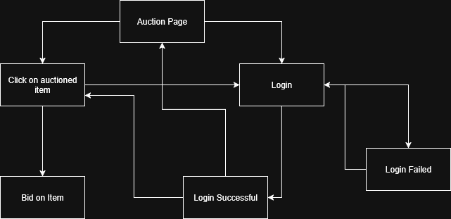

# Auction App
Insert Description Here
## Running Frontend
```
cd frontend
npm install
npm run dev
```

# Introduction
This aunction app serves as a platform to allow for any individuals to aunction off unwanted items or bid for other auctioned items. The money to be used will be fake and the items will be added by the users and also fake. This document will be going over the entire project as a whole.
# Product Functions
Features available on this application:
- Put items up for aunction
- Preview aunctioned items
- Bid on aunctioned items
- Transfer fake money into a virtual account
- Cash fake money out
# Product Perspective
- Frontend: React + Vite + TypeScript
- Backend:  ExpressJS
- Database: MongoDB
# User Characteristics
All users will be assumed to be equal in that they can login, create an account, bid on auctions, or add items to auction. The users will be as follows:
- University of Dayton Students
- University of Dayton Professors
# System Analysis
## Data Flow Diagram


## Entity Relationship Diagram

